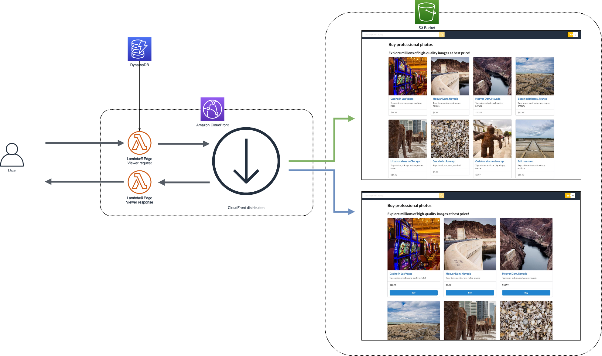

# Stack Foundation Deploy AB Plugin

## Goal

Implement an A/B testing solution for a website on AWS.

We explore the use of edge computing, which is between the browser and the backend, to provide processing close to where data is generated. This plugin lets you run code closer to users of your application, which improves performance and reduces latency, through the use of three services:

- [AWS Lambda@Edge](https://aws.amazon.com/lambda/edge) runs your code globally at AWS locations close to your users, so you can deliver full-featured, customized content with high performance, and low latency.
- With [AWS CloudFront Functions](https://docs.aws.amazon.com/AmazonCloudFront/latest/DeveloperGuide/cloudfront-functions.html) in Amazon CloudFront, you can write lightweight functions in JavaScript for high-scale, latency-sensitive CDN customizations. The CloudFront Functions allows you to run lightweight JavaScript code at the [218+ CloudFront edge locations](https://aws.amazon.com/cloudfront/features/?whats-new-cloudfront.sort-by=item.additionalFields.postDateTime&whats-new-cloudfront.sort-order=desc#Global_Edge_Network) (as of August 2021).
- [Amazon CloudFront](https://aws.amazon.com/cloudfront) delivers your content through a worldwide network of data centers called edge locations. The regional edge caches are located between your origin web server and the global edge locations that serve content directly to your viewers.

**Architecture:**

The following diagram illustrates the architecture we will implement:



## Example Scenario

We have an e-commerce website for selling digital images and we want to modify the layout of the home page in order to see if more visitors will click on a image and potentially buy it when they arrive on the new layout versus the old layout.

The architecture our website is the following:


The static resources (html, javascript, css and images) are hosted on S3 and we can imagine having APIs for the dynamic part. We will concentrate on the static part, so our website has only the static part implemented.

The home page (A version) looks like this:


The new layout (B version) has the images on three columns, a buy button and looks like this:


To test the new layout, we want to show it only to a small percentage of visitors. Based on the success of failure of the new layout we would like to be able to increase/decrease this percentage of visitor getting the new layout.

This plugin demonstrate the usage of the following AWS services:

- [Amazon CloudFront](https://aws.amazon.com/cloudfront): the fast and secure content delivery will be performed by a CloudFront distribution
- [AWS Lambda@Edge](https://aws.amazon.com/lambda/edge): cookie setting and url rewriting
- [AWS CloudFront Functions](https://docs.aws.amazon.com/AmazonCloudFront/latest/DeveloperGuide/cloudfront-functions.html): cookie setting and url rewriting
- [Amazon DynamoDB](https://aws.amazon.com/dynamodb): the dynamic data will be stored in a DynamoDB table
- [Amazon S3](https://aws.amazon.com/s3): the website’s static files and segmentation configuration file will be stored in two S3 buckets

### Prerequisites

- AWS keys setted in the runtime
- NPM
- CDK
- STK CLI

### Instructions

#### 1. Add plugin to your application

```bash
stk add plugin uxservices-web-deploy-ab
cd iac-deploy-ab
```

#### 2. Installs the dependencies

```bash
npm install
```

#### 3. Deploy

```bash
cdk deploy AB
```

#### 4. Create configuration in DynamoDB table

```bash
aws dynamodb put-item \
    --table-name WebsiteRedirection  \
    --item \
        '{"path": {"S": "/"}, "segment": {"S": "0.8"}, "version_a": {"S": "index.html"}, "version_b": {"S": "index_b.html"}}'
```

## Costs

All resources created are billed based on pay-per-use principle. The estimated cost of AWS resources is **below $2** for one day.

Except for CloudFront Functions, all services used benefit from [AWS Free Tier](https://aws.amazon.com/free/) offer.

## Cleanup

Please ensure to perform the cleanup command after the completion to avoid potentially unwanted costs.

```bash
cdk destroy AB
```

## Intended Audience

- Developers, Solutions Architect, Project Managers
- Prior experience in Cloud Computing is required
- Basic understanding of a programming language is suitable